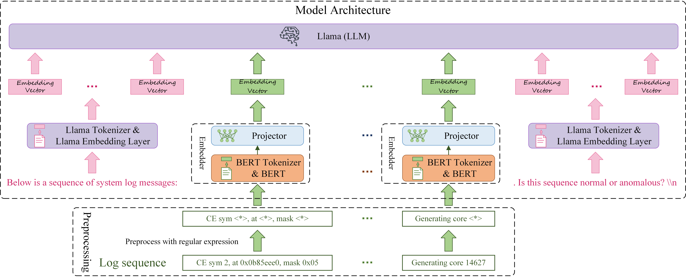

# LogLLM: Log-based Anomaly Detection Using Large Language Models #

Official Implementation of "LogLLM: Log-based Anomaly Detection Using Large Language Models"


## Datasets

The statistics of datasets used in the experiments.

|             |                    |                     |    Training Data    |  Training Data  |   Training Data   |    Testing Data     |  Testing Data   |   Testing Data    |
|:-----------:|:------------------:|:-------------------:|:-------------------:|:---------------:|:-----------------:|:-------------------:|:---------------:|:-----------------:|
|             | **# Log Messages** | **# Log Sequences** | **# Log Sequences** | **# Anomalies** | **Anomaly Ratio** | **# Log Sequences** | **# Anomalies** | **Anomaly Ratio** |
|    HDFS     |     11,175,629     |       575,061       |       460,048       |      13497      |       2.93%       |       115013        |      3341       |       2.90%       |
|     BGL     |     4,747,963      |       47,135        |       37,708        |      4009       |      10.63%       |        9427         |       817       |       8.67%       |
|   Liberty   |     5,000,000      |       50,000        |        40000        |      34144      |      85.36%       |        10000        |       651       |       6.51%       |
| Thunderbird |     10,000,000     |       99,997        |       79,997        |       837       |       1.05%       |        20000        |       29        |       0.15%       |

## Experiment Results

Experimental Results on HDFS, BGL, Liberty, and Thunderbird datasets. The best results are indicated using bold
typeface.

|            |                |   HDFS    |   HDFS    |   HDFS    |    BGL    |    BGL    |    BGL    |  Liberty  |  Liberty  |  Liberty  | Thunderbird | Thunderbird | Thunderbird |             |
|:----------:|:--------------:|:---------:|:---------:|:---------:|:---------:|:---------:|:---------:|:---------:|:---------:|:---------:|:-----------:|:-----------:|:-----------:|:-----------:|
|            | **Log Parser** | **Prec.** | **Rec.**  |  **F1**   | **Prec.** | **Rec.**  |  **F1**   | **Prec.** | **Rec.**  |  **F1**   |  **Prec.**  |  **Rec.**   |   **F1**    | **Avg. F1** |
|  DeepLog   |    &#10004;    |   0.835   |   0.994   |   0.908   |   0.166   |   0.988   |   0.285   |   0.751   |   0.855   |   0.800   |    0.017    |    0.966    |    0.033    |    0.506    |
| LogAnomaly |    &#10004;    |   0.886   |   0.893   |   0.966   |   0.176   |   0.985   |   0.299   |   0.684   |   0.876   |   0.768   |    0.025    |    0.966    |    0.050    |    0.521    |
|   PLELog   |    &#10004;    |   0.893   |   0.979   |   0.934   |   0.595   |   0.880   |   0.710   |   0.795   |   0.874   |   0.832   |    0.808    |    0.724    |    0.764    |    0.810    |
| FastLogAD  |    &#10004;    |   0.721   |   0.893   |   0.798   |   0.167   | **1.000** |   0.287   |   0.151   | **0.999** |   0.263   |    0.008    |    0.931    |    0.017    |    0.341    |
|  LogBERT   |    &#10004;    |   0.989   |   0.614   |   0.758   |   0.165   |   0.989   |   0.283   |   0.902   |   0.633   |   0.744   |    0.022    |    0.172    |    0.039    |    0.456    |
| LogRobust  |    &#10004;    |   0.961   |   1.000   |   0.980   |   0.696   |   0.968   |   0.810   |   0.695   |   0.979   |   0.813   |    0.318    |  **1.000**  |    0.482    |    0.771    |
|    CNN     |    &#10004;    |   0.966   |   1.000   |   0.982   |   0.698   |   0.965   |   0.810   |   0.580   |   0.914   |   0.709   |    0.870    |    0.690    |    0.769    |    0.818    |
| NeuralLog  |    &#10008;    |   0.971   |   0.988   |   0.979   |   0.792   |   0.884   |   0.835   |   0.875   |   0.926   |   0.900   |    0.794    |    0.931    |    0.857    |    0.893    |
|   RAPID    |    &#10008;    | **1.000** |   0.859   |   0.924   | **0.874** |   0.399   |   0.548   |   0.911   |   0.611   |   0.732   |    0.200    |    0.207    |    0.203    |    0.602    |
|   LogLLM   |    &#10008;    |   0.994   | **1.000** | **0.997** |   0.861   |   0.979   | **0.916** | **0.992** |   0.926   | **0.958** |  **0.966**  |    0.966    |  **0.966**  |  **0.959**  |

## Using Our Code to Reproduce the Results
### 1. Set Up the Environment.
- **Software Requirements**:
  - Python: 3.8.20
  - CUDA: 12.1

- **Choose one of the following methods to install dependencies**:
 
--- Option 1: Install from ```requirements.txt```
```
 conda install --yes --file requirements.txt # You may need to downgrade the torch using pip to match the CUDA version
```

--- Option 2: Install packages individually
```
conda create -n logllm python=3.8
pip install torch==2.4.0 torchvision==0.19.0 torchaudio==2.4.0 --index-url https://download.pytorch.org/whl/cu121
pip install transformers datasets peft accelerate bitsandbytes safetensors
pip install scikit-learn
pip install tqdm
```


### 2. Download open-source LLM [Meta-Llama-3-8B](https://huggingface.co/meta-llama/Meta-Llama-3-8B/tree/main), and Bert [bert-base-uncased](https://huggingface.co/google-bert/bert-base-uncased).

```
   ├── Meta-Llama-3-8B
   │ ├── config.json
   │ ├── generation_config.json
   │ ├── LICENSE
   │ ├── model-00001-of-00004.safetensors
   │ ├── model-00002-of-00004.safetensors
   │ ├── model-00003-of-00004.safetensors
   │ ├── model-00004-of-00004.safetensors
   │ ├── model.safetensors.index.json
   │ ├── special_tokens_map.json
   │ ├── tokenizer.json
   │ └── tokenizer_config.json
```

```
   ├── bert-base-uncased
   │ ├── config.json
   │ ├── model.safetensors
   │ ├── tokenizer.json
   │ ├── tokenizer_config.json
   │ └── vocab.txt
```

### 3. Prepare training and testing data

- Download BGL/HDFS_v1/Thunderbird dataset from [here](https://github.com/logpai/loghub). Download Liberty dataset
  from [here](http://0b4af6cdc2f0c5998459-c0245c5c937c5dedcca3f1764ecc9b2f.r43.cf2.rackcdn.com/hpc4/liberty2.gz).
- For **BGL**, **Thunderbird** and **Liberty**, set the following variations in **sliding_window.py** under *
  *prepareData**
  directory:
   ```
   data_dir =  # i.e. r'/mnt/public/gw/SyslogData/BGL'
   log_name =  # i.e. 'BGL.log'
   ```

  For  **Liberty**, you should activate
  ```
  start_line = 40000000
  end_line = 45000000
  ```

  For  **Thunderbird**, you should activate
  ```
  start_line = 160000000
  end_line = 170000000
  ```

  Run ```python prepareData.sliding_window.py```  from the root directory to generate training and testing data.
  Training and testing data will be saved in {data_dir}.

- For **HDFS**, set the following directories in **session_window.py** under **prepareData**
  directory:
   ```
   data_dir =  # i.e. r'/mnt/public/gw/SyslogData/HDFS_v1'
   log_name =  # i.e. 'HDFS.log'
   ```
  Run ```python prepareData.session_window.py```  from the root directory to generate training and testing data.
  Training and testing data will be saved in {data_dir}

### 4. Train our proposed deep model. This step can be skipped by directly using our fine-tuned model (ft_model_[dataset_name])

- Set the following variations in **train.py**
   ```
   Bert_path = # i.e., r"/mnt/public/gw/LLM_model/bert-base-uncased"
   Llama_path = # i.e., r"/mnt/public/gw/LLM_model/Meta-Llama-3-8B"
   dataset_name = # i.e., 'Liberty'
   data_path =  # i.e., r'/mnt/public/gw/SyslogData/{dataset_name}/train.csv'.format(dataset_name)
   ```
- Run ```python train.py``` from the root directory to get fine-tuned model.

### 5. Evaluate on test dataset.

- Set the following variations in **eval.py**
   ```
   Bert_path = # i.e., r"/mnt/public/gw/LLM_model/bert-base-uncased"
   Llama_path = # i.e., r"/mnt/public/gw/LLM_model/Meta-Llama-3-8B"
   dataset_name = # i.e., 'Liberty'
   data_path =  # i.e., r'/mnt/public/gw/SyslogData/{dataset_name}/test.csv'.format(dataset_name)
   ```
- We have provided the test file for the BGL and Liberty dataset, which can be accessed
  at [here (BGL test file)](https://drive.google.com/file/d/1aMKzhrLklnk5RX78UBc3Zx3voIIGnQzo/view?usp=sharing), and [here (Liberty test file)](https://drive.google.com/file/d/1-Z2FrsRSm8ojfOW1555obNyU6B_aRDTH/view?usp=sharing)
- Run ```python eval.py``` from the root directory. 
