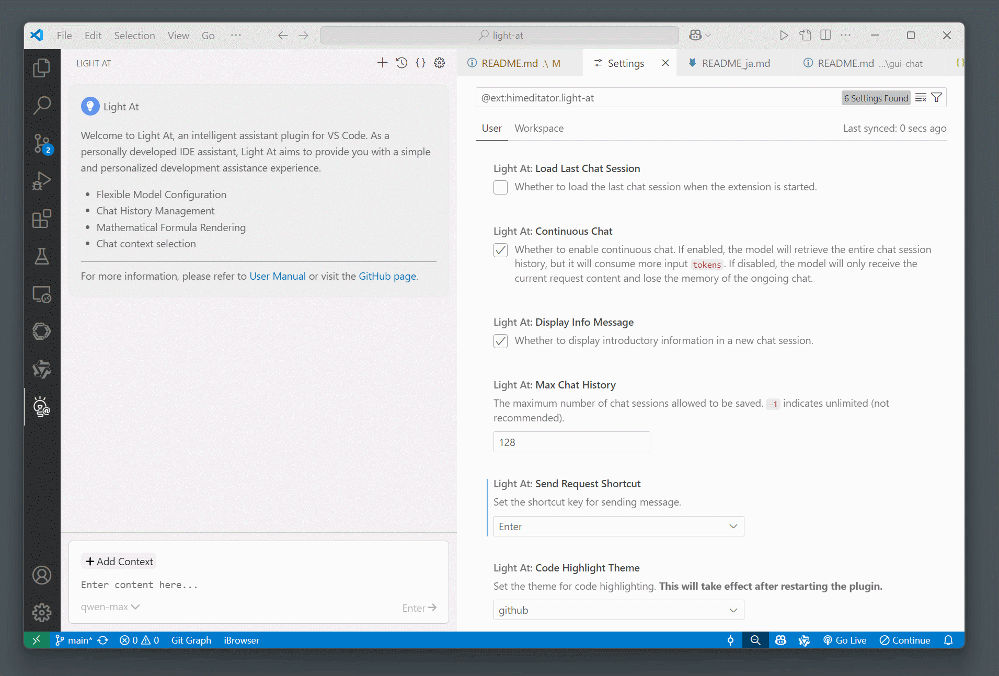
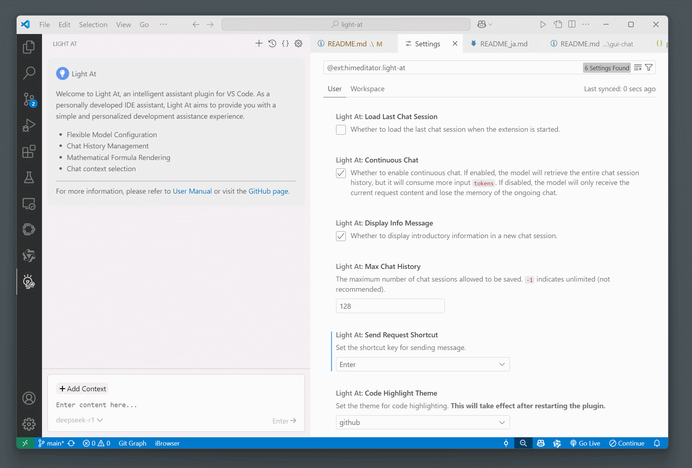
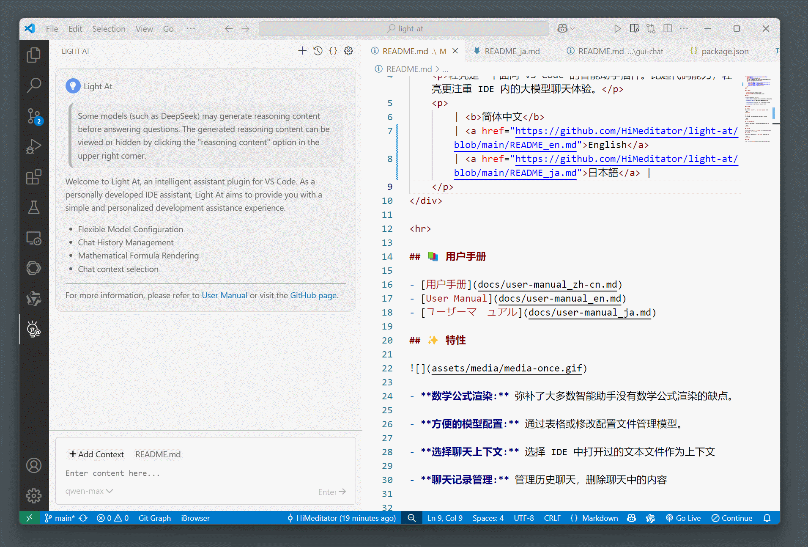
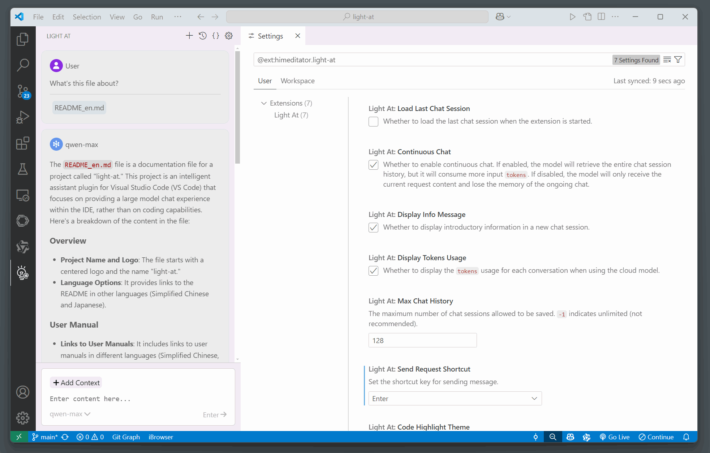

<div align="center">
    
    <h1 align="center">light-at</h1>
    <p>Light-at is an intelligent assistant plugin for VS Code that focuses more on the large model chat experience within the IDE rather than coding capabilities.</p>
    <p>
        | <a href="https://github.com/HiMeditator/light-at/blob/main/README.md">简体中文</a>
        | <b>English</b>
        | <a href="https://github.com/HiMeditator/light-at/blob/main/README_ja.md">日本語</a> |
    </p>
</div>

<hr>

## 📥 Download

<a href="https://github.com/HiMeditator/light-at/blob/main/packages/extension/CHANGELOG.md">Changelog</a>

- [Visual Studio Marketplace](https://marketplace.visualstudio.com/items?itemName=himeditator.light-at)

- [Github Release](https://github.com/HiMeditator/light-at/releases)

## 📚 User Manual

- [用户手册](docs/user-manual_zh-cn.md)
- [User Manual](docs/user-manual_en.md)
- [ユーザーマニュアル](docs/user-manual_ja.md)

## ✨ Features

- **Math Formula Rendering:** Addresses the lack of math formula rendering in most intelligent assistants.
- **Convenient Model Configuration:** Manage models through a table or by modifying configuration files.
- **Select Chat Context:** Choose text files opened in the IDE as context.
- **Chat History Management:** Manage and delete content from historical chats.

### ♾️ Mathematical Formula Rendering



### 📝 Model Configuration



### 📋 Chat Context Selection



### 💬 Chat History Management



## 🚀 Running the Project

This project is a refactor based on [light-assistant](https://github.com/HiMeditator/light-assistant), with an optimized project structure and frontend rebuilt using Vue 3.


### Install Dependencies

If your environment does not have `pnpm`, first run `npm install -g pnpm` to install it.

```bash
pnpm install
```

### Run the Frontend

Running the frontend with this command will not connect it to VS Code, so interaction is not possible.

```bash
pnpm dev
```

### Build Frontend Content into the Plugin

After making changes to the frontend, you need to execute this command to update the content in the plugin.

```bash
pnpm build
```

### Run the Plugin

Use VS Code, find `Run > Start Debugging` to run the plugin. Windows users can use the shortcut key `F5` to run the plugin.

### Package the Plugin

Before packaging, ensure that any frontend changes have been updated to the plugin using `pnpm build`.

```bash
pnpm package
```

## 👏 Acknowledgments

The plugin icon is modified from the work of [Duetone](assets/icons/credits.md).