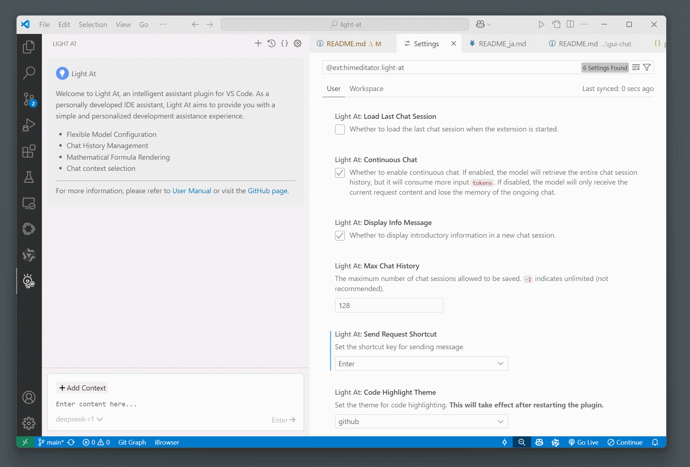
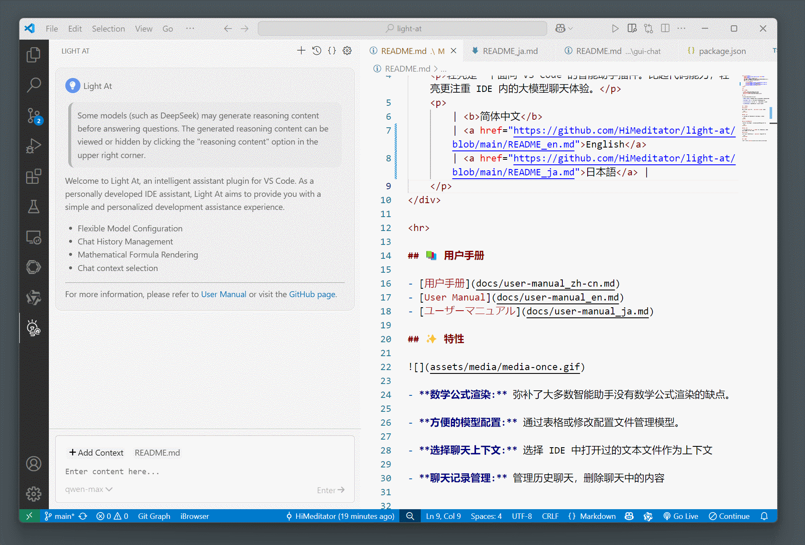
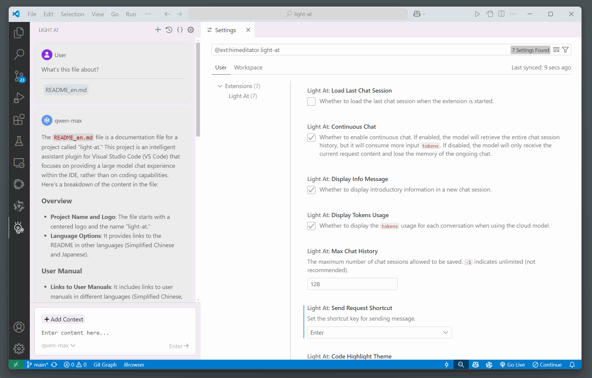

<div align="center">
    
    <h1 align="center">light-at</h1>
    <p>ライトアットは VS Code 向けのスマートアシスタントプラグインです。コード能力よりも、IDE 内での大規模モデルチャット体験に重点を置いています。</p>
    <p>
        | <a href="https://github.com/HiMeditator/light-at/blob/main/README.md">简体中文</a>
        | <a href="https://github.com/HiMeditator/light-at/blob/main/README_en.md">English</a>
        | <b>日本語</b> |
    </p>
</div>

<hr>

## 📥 ダウンロード

<a href="https://github.com/HiMeditator/light-at/blob/main/packages/extension/CHANGELOG.md">チェンジログ</a>

- [Visual Studio Marketplace](https://marketplace.visualstudio.com/items?itemName=himeditator.light-at)

- [Github Release](https://github.com/HiMeditator/light-at/releases)

## 📚 ユーザーマニュアル

- [用户手册](docs/user-manual_zh-cn.md)
- [User Manual](docs/user-manual_en.md)
- [ユーザーマニュアル](docs/user-manual_ja.md)

## ✨ 特徴

- **数学公式レンダリング:** 多くのスマートアシスタントが欠いている数学公式のレンダリング機能を補完します。
- **便利なモデル設定:** テーブルや設定ファイルの編集を通じてモデルを管理できます。
- **チャットコンテキストの選択:** IDE で開いたテキストファイルを選んでコンテキストとして使用できます。
- **チャット履歴管理:** 過去のチャットを管理し、チャット内の内容を削除できます。

### ♾️ 数式のレンダリング


### 📝 モデル設定



### 📋 チャットコンテキストの選択



### 💬 チャット履歴の管理




## 🚀 プロジェクトの実行

このプロジェクトは [light-assistant](https://github.com/HiMeditator/light-assistant) をベースにリファクタリングしたもので、プロジェクト構造を最適化し、フロントエンドを Vue 3 で再構築しています。

### 依存関係のインストール

環境に `pnpm` がない場合は、まず `npm install -g pnpm` を実行してインストールしてください。

```bash
pnpm install
```

### フロントエンドの実行

このコマンドでフロントエンドを実行すると、VS Code に接続されず、対話ができません。

```bash
pnpm dev
```

### フロントエンドの内容をプラグインにパッケージ化

フロントエンドの変更後は、このコマンドを実行してプラグインに内容を更新する必要があります。

```bash
pnpm build
```

### プラグインの実行

VS Code を使用し、`実行 > デバッグの開始` からプラグインを実行します。Windows ユーザーはショートカットキー `F5` を使用してプラグインを実行することもできます。

### プラグインのパッケージ化

パッケージ化する前に、フロントエンドの変更が `pnpm build` によってプラグインに更新されていることを確認してください。

```bash
pnpm package
```

## 👏 謝辞

プラグインアイコンは [Duetone](assets/icons/credits.md) の作品を改変しています。