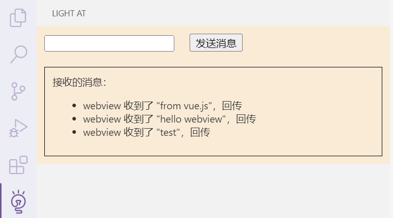

> 这是项目从零开始构建的一部分流程，这部分内容主要是记录如何用 vue 开发插件的前端部分，以及如何将插件与前端部分结合起来。
>
> 仅做存裆，对后续开发用处不大。
> 
> 参考教程：https://juejin.cn/post/7325132202970136585

## 初始化

1. 在选定文件夹 `pnpm init`

2. 创建 `pnpm-workspace.yaml`
    ```yaml
    packages:
    	- 'packages/*'
    ```

3. 创建 `packages` 文件夹

`packages` 文件夹用于存放每个子项目。

## 插件项目配置

1. 在 `/packages` 文件夹创建 vscode 插件项目：`yo code`
    ```bash
    ? What type of extension do you want to create? New Extension (TypeScript)
    ? What's the name of your extension? extension
    ? What's the identifier of your extension? extension
    ? What's the description of your extension? 
    ? Initialize a git repository? No
    ? Which bundler to use? unbundled
    ? Which package manager to use? pnpm
    ```
    
2. 插件文件夹中的 `.vscode` 文件夹移到根目录

3. 修改 `.vscode/launch.json` 中的路径，路径增加 `/packages/extension`

4. 修改插件文件夹的 `tsconfig.json` 和 `package.json` 中的路径，将 `out` 改为 `out/extension`

> `2,3`  是为了使得能在根目录运行插件做准备
>
> `4` 是将构建目录多加一个 `extension` 层级，和前端构建代码分开  

## vue 前端配置

1. 在 `/packages` 创建 vue 项目：`pnpm create vue@latest`
    ```bash
    ┌  Vue.js - The Progressive JavaScript Framework
    │
    ◇  请输入项目名称：
    │  gui-chat
    │
    ◆  请选择要包含的功能： (↑/↓ 切换，空格选择，a 全选，回车确认)
    │  ◼ TypeScript
    │  ◻ JSX 支持
    │  ◻ Router（单页面应用开发）
    │  ◼ Pinia（状态管理）
    │  ◻ Vitest（单元测试）
    │  ◻ 端到端测试
    │  ◻ ESLint（错误预防）
    │  ◻ Prettier（代码格式化）
    └
    ```

2. `pnpm install` 安装依赖

3. `vite.config.ts` 修改配置
    ```typescript
    import { fileURLToPath, URL } from 'node:url'

    import { defineConfig } from 'vite'
    import vue from '@vitejs/plugin-vue'
    // import vueDevTools from 'vite-plugin-vue-devtools'

    // https://vite.dev/config/
    export default defineConfig({
    plugins: [
        vue(),
        // vueDevTools(),
    ],
    base: './',
    resolve: {
        alias: {
        '@': fileURLToPath(new URL('./src', import.meta.url))
        },
    },
    build: {
        outDir: '../extension/out/gui-chat',
        emptyOutDir: true,
    },
    })
    ```

## 修改 `package.json` 的 `scripts` 配置

1. 根目录 `package.json` 中的 `scripts` 配置
    ```json
    "scripts": {
        "dev": "pnpm run -F gui-chat dev",
        "build": "pnpm run -F gui-chat build",
        "watch": "pnpm run -F extension watch",
        "both": "pnpm run build && pnpm run watch",
        "package": "pnpm run -F extension package"
    }
    ```

2. 插件 `package.json` 中的 `scripts` 配置新增 `"package": "pnpm vsce package"`

## 运行

执行 `pnpm run both` 构建，按 `F5` 即可打开插件。观察插件目录 `/out` 文件夹，应该存在两个子文件夹：`/extension`, `/gui-chat`。

## 修改插件

新增侧边栏 Webview View，装载插件目录 `out/gui-chat/index.html` 网页，并将其中的相对路径修改为 webview 可识别的路径。

修改前端界面，改为测试通信。

然后再次运行插件，即可看到侧边栏装载了 vue 页面。

完整的代码见第一次提交。


