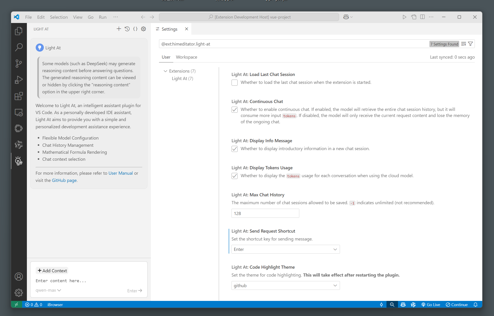

# Light At ユーザーマニュアル

プラグインバージョン v0.1.1 に対応

> この文書は大規模モデルを使用して翻訳されていますので、内容に正確でない部分があるかもしれません。

- [简体中文版](user-manual_zh-cn.md)
- [English Version](user-manual_en.md)



## 📝 モデルの設定

### 設定ファイルでのモデル設定

プラグインインターフェース右上の `コンフィグファイル` オプションをクリックし、プラグインコンフィグファイルに移動します。ここでは、チャットモデルを素早く設定できます。

設定フォーマットは以下の通りです：

```json
{
  "models": [
    {
      "id": "p_Xb-FcE7SeVgSG6SfdWB",
      "type": "ollama/openai",
      "model": "model name",
      "title": "display name",
      "baseURL": "https://model_base_url",
      "host": "Ollama serve host",
      "apiKey": "sk-********************************"
    }
  ]
}
```
- `id`：必須。モデルの一意の識別子で、他の `id` と異なるようにカスタマイズしてください。
- `type`：必須。モデルのタイプで、選択可能な値は `ollama` または `openai` です。前者はローカルの [Ollama](https://github.com/ollama/ollama) で設定されたモデルを使用し、後者は node.js の OpenAI ライブラリを使用してクラウドモデルを呼び出します。
- `model`：必須。モデル名、例：`llama3.3-70b-instruct`。
- `title`：オプション。モデルの表示名で、設定しない場合は `model` の値が使用されます。
- `baseURL`：`type` が `openai` の場合必須。API リクエストのベース URL で、モデル提供者によります。
- `host`：オプション。Ollama サーバーのホストアドレス、またはlocalhost のポート番号。
- `apiKey`：`type` が `openai` の場合必須。API キーはモデル提供者から取得してください。

> **注意:** `apiKey` フィールドには、環境変数を使用できます。設定形式は次のとおりです：`env@API_KEY_NAME` ここで、`API_KEY_NAME` は環境変数に保存されている実際の API キーの名前です。今設定した環境変数はすぐに有効にならない場合があります。一般的に、コンピュータを再起動する必要があります。

以下はいくつかのプロバイダーの `baseURL` です：
- OpenAI: https://api.openai.com/v1
- DeepSeek：https://api.deepseek.com
- 阿里云（アリババクラウド）：https://dashscope.aliyuncs.com/compatible-mode/v1

具体的な例は以下の通りです：

```json
{
  "models": [
    {
      "id": "qwen2.5-no.001",
      "type": "ollama",
      "model": "qwen2.5",
      "title": "qwen2.5-7b"
    },
    {
      "id": "deepseek-r1-no.002",
      "type": "ollama",
      "model": "deepseek-r1"
    },
    {
      "id": "WyCSP4M3CZluzoNgNCm2k",
      "type": "openai",
      "model": "qwen-max",
      "baseURL": "https://dashscope.aliyuncs.com/compatible-mode/v1",
      "apiKey": "sk-********************************"
    },
    {
      "id": "uXPF7fCW2paRZcVyfjURO",
      "model": "gpt-4o",
      "type": "openai",
      "baseURL": "https://api.openai.com/v1",
      "apiKey": "env@OPENAI_API_KEY"
    }
  ]
}
```

設定ファイルを作成したら、`モデルを選択` オプションにマウスをホバーし、表示される `コンフィグを読み込む` オプションをクリックすると、設定したモデルを読み込みます。

### プラグインでのモデル設定

プラグイン左下の `モデルを選択` オプションにマウスをホバーし、表示される `モデルを追加` オプションをクリックすると、モデル追加ダイアログが表示されます。関連情報を入力し、送信するとモデルを追加できます。

## 💬 チャット

### チャットオプション

モデルを設定したら、チャットを開始できます。入力欄に内容を入力し、`Ctrl+Enter / Enter` を押すか、送信オプションをクリックすると、チャット内容を送信できます。

入力欄上部の `コンテキストを追加` オプションをクリックすると、IDE 内のファイル内容をコンテキストとして追加できます。**コードエディタで開いたファイルのみサポートされています。**

既にコンテキストに追加されたファイルをクリックすると、そのファイルの選択を解除できます。

チャットメッセージ内のファイルタグ（`「選択された内容」`を含まないもの）をクリックすると、対応するファイルをエディターで迅速に開くことができます。

### 会話管理

プラグインインターフェース右上の `チャット履歴` オプションをクリックすると、チャット履歴ファイルを確認できます。

プラグインインターフェース右上の `新しいチャット` オプションをクリックすると、新しい会話を開始できます。

### チャット内容

大規模モデルがコンテンツを生成している間、入力欄左上の `生成を停止` オプションをクリックして、現在の回答の受信を停止できます。

## ⚙️ 設定

プラグインインターフェース右上の `設定` をクリックすると、プラグイン設定ページに移動できます。

- `Light At: Load Last Chat Session` はデフォルトでオフです。有効にすると、プラグインを開くたびに自動的に前回のチャットセッションがロードされます。
- `Light At: Continuous Chat` はデフォルトでオンです。無効にすると、メッセージを送信するたびにモデルは現在のリクエスト内容のみを受け取り、同じ会話での記憶能力を失います。これにより、モデルへの入力トークン数を減らすことができます。
- `Light At: Display Info Message` はデフォルトでオンです。無効にすると、新しい会話では歓迎メッセージが表示されなくなります。
- `Light At: Display Tokens Usage` はデフォルトでオンです。無効にすると、オンラインモデルのトークン使用状況が表示されなくなります。
- `Light At: Max Chat History` のデフォルト値は $128$ です。保存されるチャット履歴の最大数を設定します。範囲は $-1~255$ で、$-1$ は制限なしを表します。多くのチャット履歴は、プラグインの起動速度をわずかに低下させる可能性があります。
- `Light At: Send Request Shortcut` のデフォルトは `Ctrl+Enter` です。リクエスト送信のショートカットキーを設定します。この設定では複数行の入力が可能です。`Enter` を選択すると改行ができませんが、改行を含むコンテンツの貼り込みは可能です。
- `Light At: Code Highlight Theme` のデフォルトは `github` です。チャット中のコードハイライトテーマを設定します。最初の3つは明るいテーマで、後ろの3つは暗いテーマです。変更後、プラグインを再起動する必要があります。
