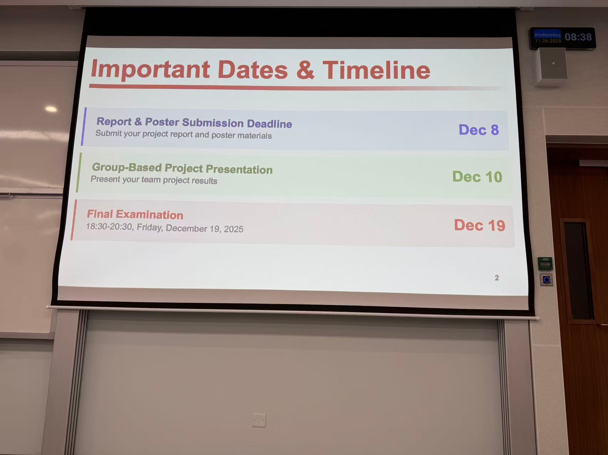

# [Meeting 10] 会议记录

## 会议基本信息

- **会议主题**:
- **会议日期**: 2025年11月26日
- **会议时间**: 9:30 - 11:00 (GMT+8)
- **会议地点**: 宿舍楼四座 - 0869
- **记录人**: 张佳俊
- **参会人员**:

  - 张志宏（72510166）
  - 付钰（72512240）
  - 冼思敏（72512018）
  - 李文灏（72510850）
  - 张佳俊（72510615）
  - 冷爽（72512123）
- **缺席人员**: 无

---

## 检查完善项目文档内容与PPT

TODO:

* 调整 Sprint3 和 evaluation 部分的内容
* 使用basic simulation
* 将技术成果整合融入摘要部分
* 继续完善PPT内容

## 项目 $\LaTeX$ [文档](https://cn.overleaf.com/4372249129crfwppnmqjxn#2795f2)

- 文档链接：[https://cn.overleaf.com/4372249129crfwppnmqjxn#2795f2](https://cn.overleaf.com/4372249129crfwppnmqjxn#2795f2)
- **TODO: 在本周日（11.30）前补充完成其中的内容。**

## 其他内容

日志类型包括：

```
* BGL
* HDFS
* Liberty
* Thunderbird
* Apache
* Linux
* SSH
* Hadoop
```

## 重要时间节点：



## 下周工作安排

- 完善项目文档内容并继续完善PPT
- **在本周日（11.30）前补充完成 $\LaTeX$ [文档]([https://cn.overleaf.com/4372249129crfwppnmqjxn#2795f2](https://cn.overleaf.com/4372249129crfwppnmqjxn#2795f2))的内容**
- PPT完成后，每个人准备自己负责部分的讲稿
- 准备就绪后开始录制视频了
- 等待下午通知给出template后明确课程要求，继续完成其他部分内容

---

## 下次会议安排

- **暂定议题**:
- **会议时间**: 暂定2025年12月4日 14:30

---
